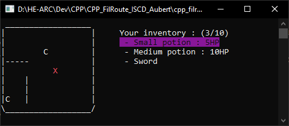
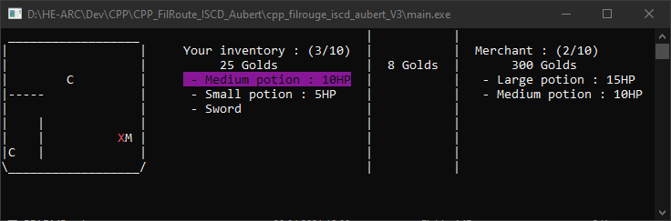

# CPP_FilRouge_ISCD_Aubert

## Control
**You spawn in a room. Your hero is represented with a red X**

By pressing the `h` key, you open the keys help 
- You can move your hero with `wasd` keys
- You can show your hero's stats by pressing the `,` key
- You can show your hero's inventory by pressing the `TAB` key
- You can interact with objects in the room by pressing the `f` key
- You can exit the game by pressing the `q` key

## Chest
In the room, **C** character represents chest.
If you go next to a chest and interact with it by pressing the `f` key, its content will be displayed on the right. The highlighted item is currently selected.

### Move in inventory

With the `w` and `s` keys, you can change the selected item.

### Take item

Then, by pressing the `f` key, if you have enough places in your inventory, the selectionned item will be added into your inventory.

### Take all the items

Or, by pressing simultaneously the `CTRL` + `f` keys, if you have enough places in your inventory, all the items will be added into your inventory.

### Quit chest inventory

You can exit the chest inventory by pressing the `ESCAPE` or `TAB` key.

## Inventory
The `TAB` key opens
In your inventory (10 items max), the same movement system as for the chest inventory is used.

### Interaction with items

By pressing `f`, you will interact with the selected item :
- Potion : You will drink the potion, and your HPs will increase
- Weapon : The weapon is then the current weapon (the weapon held by the hero).

### Drop item

By pressing the `q` key, is you are next to a chest, the selected item will be added into the chest inventory.

### Quit inventory

You can exit your inventory by pressing the `TAB` key.

## Merchant - Trading
Merchant are represented in the room with **M** character.
If you go next to a Merchant and interact with it by pressing the `f` key, the trading interface will be diplayed.

## Move

With the `a` and `d` keys, you can switch from your/Merchant's inventory.

Like in your inventory, you can change the selected with with the `w` and `s` keys.

The price of the current/selected item is displayed in the center of the screen.

## Buy / Sell

By pressing `f` to interact :
- If the item is yours, it will be sold to the Merchant, if he has enough money.
- If the item is his, you will buy it, if you have enough money.

## Quit trading

You can exit your inventory by pressing the `TAB` key.

